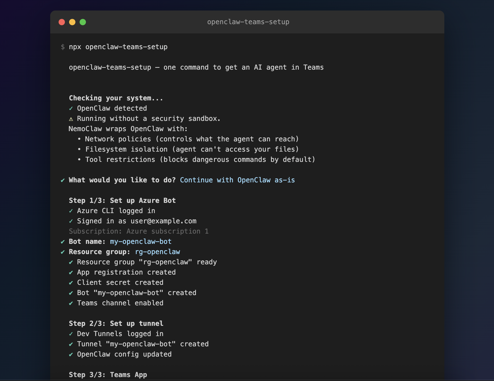
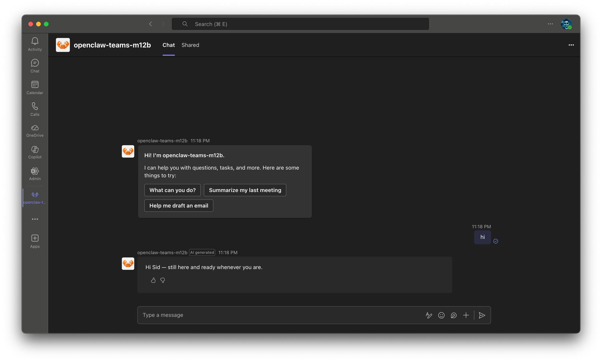

# openclaw-teams-setup

One command to get an OpenClaw-powered AI agent running in Microsoft Teams.

```
npx openclaw-teams-setup
```





Getting an AI agent into Teams today requires ~12 manual steps across Azure Portal, Teams Developer Portal, and the terminal. This tool reduces it to one command.

## Quick start

### Before you begin

You need two things:

1. **Node.js 18 or later** — download from [nodejs.org](https://nodejs.org) if you don't have it. Check with `node --version`.
2. **An Azure account** — [create a free one](https://azure.microsoft.com/free) if you don't have one. Free tier is enough.

You also need **OpenClaw** or **NemoClaw** installed. If you don't have either, the tool will install NemoClaw for you.

### Step 1: Run the setup

Open a terminal and run:

```
npx openclaw-teams-setup
```

The tool will walk you through everything:

- It detects whether you have OpenClaw/NemoClaw and adapts accordingly
- It installs the Azure CLI and Dev Tunnels CLI if you don't have them (asks first)
- It opens a browser for you to sign in to Azure
- It asks you for a bot name and resource group name (defaults are fine)
- It creates the Azure bot, sets up a tunnel, configures OpenClaw, and generates the Teams app

At the end, you'll see something like:

```
  ┌─────────────────────────────────────────────────────┐
  │                                                       │
  │  Almost done! Upload the app to Teams:                │
  │                                                       │
  │  1. Open Microsoft Teams                              │
  │  2. Click "Apps" in the sidebar                       │
  │  3. Click "Manage your apps"                          │
  │  4. Click "Upload an app" → "Upload a custom app"    │
  │  5. Select: ~/Desktop/openclaw-teams-app.zip          │
  │                                                       │
  │  Then send the bot a message to test!                 │
  │                                                       │
  └─────────────────────────────────────────────────────┘
```

### Step 2: Upload to Teams

1. Open **Microsoft Teams**
2. Click **Apps** in the left sidebar
3. Click **Manage your apps** at the bottom
4. Click **Upload an app** → **Upload a custom app**
5. Select the `openclaw-teams-app.zip` file (on your Desktop)
6. Click **Add**

### Step 3: Start chatting

Find the bot in Teams (search for the name you chose) and send it a message. It should respond.

### Starting the bot again later

The bot only works when the tunnel is running. If you restart your computer or close the terminal, just run the same command again:

```
npx openclaw-teams-setup
```

It detects the existing setup and starts the tunnel automatically. No need to redo the setup.

## What it does

The tool auto-detects your setup and takes the right path:

| Your setup | What happens |
|---|---|
| **NemoClaw installed** | Skips straight to Teams setup |
| **OpenClaw installed** (no NemoClaw) | Offers NemoClaw upgrade, then Teams setup |
| **Nothing installed** | Installs NemoClaw + OpenClaw, then Teams setup |

The Teams setup automates:

1. **Azure Bot** — creates app registration, client secret, bot resource (F0 free tier), enables Teams channel
2. **Tunnel** — sets up a persistent dev tunnel so Teams can reach your local agent
3. **Config** — installs the `@openclaw/msteams` plugin, writes credentials to `openclaw.json`, sets DM policy to allow you
4. **App package** — generates a Teams manifest ZIP with icons and RSC permissions, ready to sideload

## How it works

```
Teams  →  Dev Tunnel  →  localhost:3978  →  OpenClaw gateway (msteams plugin)  →  LLM
```

- The **dev tunnel** gives your machine a public URL that Teams webhooks can reach
- The **OpenClaw msteams plugin** listens on port 3978 and handles Bot Framework protocol
- The **Azure Bot** routes Teams messages to your tunnel URL
- The tunnel URL is **stable** — it persists across restarts with named devtunnels

## Other commands

```bash
npx openclaw-teams-setup --status         # Show current state
npx openclaw-teams-setup --tunnel         # Start tunnel explicitly
npx openclaw-teams-setup --teardown       # Remove bot, tunnel, config
npx openclaw-teams-setup --reconfigure    # Re-run config step
npx openclaw-teams-setup --yes            # Non-interactive (accept defaults)
```

## Troubleshooting

**Bot not responding?**
- Make sure the tunnel is running (`npx openclaw-teams-setup`)
- Check the channel status: `openclaw channels status` — it should say "running"
- Check gateway logs: `openclaw channels logs`

**"Not allowlisted" in logs?**
- The DM policy may be blocking your messages. The tool sets it to allow the Azure user who ran setup. Run `npx openclaw-teams-setup --reconfigure` to update.

**Tunnel URL changed?**
- The tool auto-updates the Azure bot endpoint when you start the tunnel. Just run `npx openclaw-teams-setup` again.

**Bot name already taken?**
- Azure bot names must be globally unique. Try a more specific name like `mycompany-openclaw-bot`.

## NemoClaw sandbox policy

When running inside a NemoClaw sandbox (network-isolated by default), the tool installs a `teams.yaml` network policy preset that allows:

- `login.microsoftonline.com` — Azure AD auth
- `login.botframework.com` — Bot Framework auth
- `smba.trafficmanager.net` — Bot Connector (reply delivery)
- `api.botframework.com` — Bot Framework API
- `graph.microsoft.com` — Microsoft Graph API

## Project structure

```
openclaw-teams-setup/
├── bin/cli.js              # Entry point, arg parsing, wizard orchestration
├── lib/
│   ├── azure-auth.js       # az login, tenant/subscription extraction
│   ├── azure-bot.js        # Bot CRUD (create, update endpoint, delete)
│   ├── deps.js             # Auto-install az + devtunnel
│   ├── detect.js           # Three-path detection (NemoClaw/OpenClaw/nothing)
│   ├── manifest.js         # Teams manifest ZIP generation
│   ├── nemoclaw.js         # NemoClaw install + onboard delegation
│   ├── openclaw-config.js  # Read/write openclaw.json (JSON5)
│   ├── policy.js           # NemoClaw network policy for Teams
│   ├── state.js            # ~/.openclaw-teams-setup.json persistence
│   ├── status.js           # --status command
│   ├── teardown.js         # --teardown command
│   ├── tunnel.js           # devtunnel/ngrok/cloudflared setup + hosting
│   └── ui.js               # Console helpers (colors, spinners, prompts)
├── templates/
│   ├── manifest.template.json
│   ├── teams.yaml          # NemoClaw network policy preset
│   ├── color.png           # 192x192 bot icon
│   └── outline.png         # 32x32 bot icon
└── test/                   # Unit, integration, and E2E tests
```

## Testing

```bash
npm test                    # Unit tests (40 tests, ~1s)
npm run test:azure          # Azure integration tests (requires az login + OPENCLAW_TEAMS_TEST_RG env var)
bash test/e2e-setup.sh      # Provision E2E VM
bash test/e2e-run.sh        # Run E2E tests on VM
bash test/e2e-teardown.sh   # Clean up VM
```

## License

MIT
